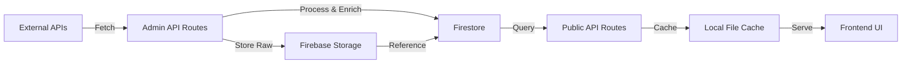

# 🛡️ Optimus Threat Intelligence Platform

<div align="center">


**A cutting-edge, real-time cybersecurity threat intelligence aggregation and analysis platform**

*Empowering security teams with unified, enriched vulnerability intelligence from multiple authoritative sources*

**Created by [Anubhav Singh](https://github.com/anu-sin-theta)**

[Features](#-features) • [Tech Stack](#-tech-stack) • [Quick Start](#-quick-start) • [API Documentation](#-api-documentation) • [Architecture](#-architecture)

</div>

---

## 📸 Screenshots

<div align="center">

### Main Dashboard


### Vulnerability Analysis


### Threat Intelligence View


### CVE Details


### Search & Filtering


### Analytics Dashboard


</div>

---

## 🎯 Overview

**Optimus** is a comprehensive threat intelligence platform that aggregates, enriches, and correlates vulnerability data from multiple authoritative cybersecurity sources. Built with modern web technologies, it provides security analysts with a unified view of the threat landscape, enabling faster response times and better-informed security decisions.

### 🌟 Key Highlights

- **🔄 Real-time Data Aggregation** - Automatically fetches and synchronizes data from 7+ threat intelligence sources
- **🧠 Intelligent Enrichment** - Cross-references CVEs with MITRE ATT&CK, CISA KEV, Red Hat advisories, and threat indicators
- **📊 Advanced Analytics** - Visualize threat trends, vulnerability graphs, and exploit timelines
- **🚀 High Performance** - Built on Next.js 15 with React Server Components for optimal performance
- **🔐 Enterprise-Ready** - Firebase authentication, role-based access control, and secure API endpoints
- **📱 Responsive Design** - Beautiful, modern UI that works seamlessly across all devices

---

## ✨ Features

### 🎯 Core Capabilities

#### 📡 Multi-Source Intelligence Aggregation
- **NVD (National Vulnerability Database)** - Comprehensive CVE data with CVSS scoring
- **CISA KEV** - Known Exploited Vulnerabilities catalog
- **MITRE ATT&CK** - Adversary tactics and techniques mapping
- **Red Hat Security** - Enterprise Linux vulnerability advisories
- **ThreatFox** - Real-time IOC (Indicators of Compromise) feed
- **AbuseIPDB** - Malicious IP address reputation data
- **CVElist v5** - CNA (CVE Numbering Authority) enriched data

#### 🔍 Advanced Search & Discovery
- **Multi-source search** - Query across all integrated threat feeds simultaneously
- **Smart filtering** - Filter by severity, date range, vendor, product, and more
- **CVE deep-dive** - Detailed vulnerability analysis with enriched metadata
- **Threat correlation** - Automatic linking of related threats and IOCs

#### 📊 Visualization & Analytics
- **Threat trends dashboard** - 30-day vulnerability and exploit timeline
- **Vulnerability graphs** - Interactive relationship mapping between CVEs, CPEs, and CWEs
- **Severity distribution** - Real-time statistics on threat landscape
- **Exploit tracking** - Monitor actively exploited vulnerabilities

#### 🔐 Security & Access Control
- **Firebase Authentication** - Secure Google OAuth integration
- **Role-based access** - Separate admin and user interfaces
- **API rate limiting** - Protect against abuse and ensure fair usage
- **Secure data storage** - Firebase Firestore and Cloud Storage integration

---

## 🛠️ Tech Stack

### Frontend
- **[Next.js 15.5.4](https://nextjs.org/)** - React framework with App Router
- **[React 19](https://react.dev/)** - Latest React with Server Components
- **[TypeScript 5](https://www.typescriptlang.org/)** - Type-safe development
- **[Tailwind CSS 4](https://tailwindcss.com/)** - Utility-first styling
- **[Radix UI](https://www.radix-ui.com/)** - Accessible component primitives
- **[Recharts](https://recharts.org/)** - Data visualization
- **[React Flow](https://reactflow.dev/)** - Interactive node-based graphs

### Backend & APIs
- **Next.js API Routes** - Serverless API endpoints
- **Firebase Admin SDK** - Server-side Firebase operations
- **Custom API Clients** - Typed clients for external threat feeds

### Database & Storage
- **Firebase Firestore** - NoSQL document database for enriched data
- **Firebase Cloud Storage** - Raw data archival and versioning
- **Local File Cache** - Performance optimization with TTL-based caching

### Development Tools
- **pnpm** - Fast, disk space efficient package manager
- **ESLint** - Code quality and consistency
- **Geist Font** - Modern, clean typography

---

## 🚀 Quick Start

### Prerequisites

- **Node.js** 18+ (recommended: 20+)
- **pnpm** 8+ (or npm/yarn)
- **Firebase Project** with Firestore and Storage enabled
- **API Keys** for threat intelligence sources (see [API Keys](#-api-keys-required))

### Installation

1. **Clone the repository**
   ```bash
   git clone https://github.com/anu-sin-theta/Optimus-Threat-Intelligence.git
   cd Optimus-Threat-Intelligence
   ```

2. **Install dependencies**
   ```bash
   pnpm install
   ```

3. **Configure environment variables**
   
   Create `.env` and `.env.local` files in the project root:

   **`.env`** (Public variables)
   ```env
   # NVD API (Get from: https://nvd.nist.gov/developers/request-an-api-key)
   NVD_API_KEY=your_nvd_api_key_here

   # ThreatFox API (Get from: https://threatfox.abuse.ch/)
   THREATFOX_API_KEY=your_threatfox_api_key_here

   # AbuseIPDB API (Get from: https://www.abuseipdb.com/api)
   ABUSEIPDB_API_KEY=your_abuseipdb_api_key_here

   # NewsAPI (Get from: https://newsapi.org/)
   NEWS_API_KEY=your_newsapi_key_here

   # Vulners API (Get from: https://vulners.com/api)
   VULNERS_API_KEY=your_vulners_api_key_here
   NEXT_PUBLIC_VULNERS_API_URL=http://localhost:5000

   # Firebase Client Configuration
   NEXT_PUBLIC_FIREBASE_API_KEY=your_firebase_api_key
   NEXT_PUBLIC_FIREBASE_AUTH_DOMAIN=your-project.firebaseapp.com
   NEXT_PUBLIC_FIREBASE_PROJECT_ID=your-project-id
   NEXT_PUBLIC_FIREBASE_STORAGE_BUCKET=your-project.firebasestorage.app
   NEXT_PUBLIC_FIREBASE_MESSAGING_SENDER_ID=your_sender_id
   NEXT_PUBLIC_FIREBASE_APP_ID=your_app_id
   ```

   **`.env.local`** (Server-side only)
   ```env
   # Firebase Storage Bucket (Server-side)
   FIREBASE_STORAGE_BUCKET=your-project.firebasestorage.app

   # Optional: Custom app URL for production
   NEXT_PUBLIC_APP_URL=https://your-domain.com
   ```

4. **Set up Firebase Admin SDK**
   
   - Download your Firebase service account key from Firebase Console
   - Save it as `app/admin/lib/key.json`
   - **⚠️ Important:** Never commit this file to version control!

5. **Create database directory**
   ```bash
   mkdir -p database
   ```

6. **Run the development server**
   ```bash
   pnpm dev
   ```

7. **Open your browser**
   
   Navigate to [http://localhost:3000](http://localhost:3000)

---

## 🔑 API Keys Required

| Service | Required | Free Tier | Sign Up Link |
|---------|----------|-----------|--------------|
| **NVD** | ✅ Yes | ✅ Yes (Rate limited) | [Request API Key](https://nvd.nist.gov/developers/request-an-api-key) |
| **Firebase** | ✅ Yes | ✅ Yes (Generous limits) | [Firebase Console](https://console.firebase.google.com/) |
| **ThreatFox** | ⚠️ Optional | ✅ Yes | [ThreatFox](https://threatfox.abuse.ch/) |
| **AbuseIPDB** | ⚠️ Optional | ✅ Yes (1000 checks/day) | [AbuseIPDB](https://www.abuseipdb.com/api) |
| **NewsAPI** | ⚠️ Optional | ✅ Yes (100 requests/day) | [NewsAPI](https://newsapi.org/) |
| **Vulners** | ⚠️ Optional | ✅ Yes | [Vulners](https://vulners.com/api) |

> **Note:** The platform will function with just NVD and Firebase. Other sources enhance the enrichment capabilities.

---

## 📁 Project Structure

```
Optimus-Threat-Intelligence/
├── app/                          # Next.js App Router
│   ├── api/                      # Public API routes
│   │   ├── nvd/                  # NVD CVE endpoints
│   │   ├── cisa/                 # CISA KEV endpoints
│   │   ├── threatfox/            # ThreatFox IOC endpoints
│   │   ├── enriched-vulnerabilities/  # Unified enriched data
│   │   └── ...
│   ├── admin/                    # Admin dashboard & APIs
│   │   ├── api/                  # Admin-only endpoints (data ingestion)
│   │   ├── lib/                  # Admin utilities
│   │   └── page.tsx              # Admin dashboard UI
│   ├── landing/                  # Landing page
│   ├── login/                    # Authentication
│   ├── nvd/[id]/                 # CVE detail pages
│   └── page.tsx                  # Main dashboard
├── components/                   # React components
│   ├── ui/                       # Radix UI components
│   ├── auth-provider.tsx         # Firebase auth context
│   ├── footer.tsx                # App footer
│   └── ...
├── lib/                          # Shared utilities
│   ├── api-client/               # External API clients
│   │   ├── nvd.ts                # NVD client
│   │   ├── cisa.ts               # CISA client
│   │   ├── threatfox.ts          # ThreatFox client
│   │   └── ...
│   ├── firebase.ts               # Firebase client config
│   ├── rate-limiter.ts           # API rate limiting
│   ├── data-cache.ts             # File-based caching
│   └── ...
├── database/                     # Local cache storage
├── public/                       # Static assets
├── styles/                       # Global styles
├── .env                          # Environment variables
├── .env.local                    # Local environment overrides
└── package.json                  # Dependencies
```

---

## 🔌 API Documentation

### Public Endpoints

#### Get Recent CVEs
```http
GET /api/nvd?days=7&limit=100&offset=0
```

**Query Parameters:**
- `days` - Number of days to look back (default: 7)
- `limit` - Maximum results to return (default: 10000)
- `offset` - Pagination offset (default: 0)
- `forceUpdate` - Bypass cache (default: false)

**Response:**
```json
{
  "vulnerabilities": [...],
  "totalResults": 1234,
  "stats": {
    "CRITICAL": 45,
    "HIGH": 234,
    "MEDIUM": 567,
    "LOW": 388,
    "UNKNOWN": 0
  },
  "source": "cache" | "nvd_api" | "fallback_cache"
}
```

#### Get Enriched Vulnerabilities
```http
GET /api/enriched-vulnerabilities
```

Returns CVEs enriched with CISA KEV, MITRE ATT&CK, Red Hat advisories, and threat intelligence.

#### Search Across Sources
```http
GET /api/search/nvd?query=CVE-2024-1234
GET /api/search/threatfox?query=malware
```

#### Get Threat Trends
```http
GET /api/threat-trends
```

Returns 30-day trend data for CVEs and exploits.

### Admin Endpoints

Admin endpoints require authentication and are used for data ingestion:

```http
GET /admin/api/nvd          # Fetch and store NVD data
GET /admin/api/cisa         # Fetch and store CISA KEV
GET /admin/api/mitre        # Fetch and store MITRE ATT&CK
GET /admin/api/threatfox    # Fetch and store ThreatFox IOCs
GET /admin/api/redhat       # Fetch and store Red Hat advisories
```

---

## 🏗️ Architecture

### Data Flow



### Enrichment Pipeline

1. **Data Ingestion** - Admin APIs fetch raw data from external sources
2. **Raw Storage** - Original data stored in Firebase Storage with timestamps
3. **Processing** - Data normalized and structured
4. **Enrichment** - Cross-reference with other sources (MITRE, CISA, etc.)
5. **Storage** - Enriched data stored in Firestore
6. **Caching** - Frequently accessed data cached locally with TTL
7. **Delivery** - Public APIs serve enriched, cached data to frontend

### Caching Strategy

- **L1 Cache:** In-memory (Next.js runtime)
- **L2 Cache:** Local file system (1-24 hour TTL)
- **L3 Cache:** Firestore (persistent)
- **L4 Cache:** Firebase Storage (raw data archive)

---

## 🎨 Features in Detail

### Vulnerability Dashboard
- Real-time vulnerability feed with severity indicators
- Advanced filtering and sorting capabilities
- Quick actions: View details, export, share
- Responsive card and table layouts

### CVE Detail Page
- Comprehensive vulnerability information
- CVSS v3.1/v3.0/v2.0 scoring breakdown
- Affected products and versions (CPE)
- Related CWE (Common Weakness Enumeration)
- MITRE ATT&CK technique mapping
- Known exploits and IOCs
- Red Hat security advisories
- Timeline visualization

### Threat Intelligence
- IOC tracking (IPs, domains, hashes, URLs)
- Malware family attribution
- Confidence scoring
- Geographic distribution
- Temporal analysis

### Admin Dashboard
- Data source health monitoring
- Manual data refresh triggers
- Ingestion logs and statistics
- API quota tracking

---

## 🔒 Security Considerations

### Authentication
- Firebase Authentication with Google OAuth
- Session-based cookie authentication
- Protected admin routes via middleware

### API Security
- Rate limiting per API source
- Request timeout protection
- Input validation and sanitization
- CORS configuration

### Data Privacy
- No PII collection
- Public threat intelligence only
- Secure credential management
- Environment variable isolation

---


### Type Checking
```bash
npx tsc --noEmit
```

---

## 📊 Performance

- **Build Size:** ~102 kB shared JS
- **First Load:** ~103-379 kB (route dependent)
- **Cache Hit Rate:** >90% for frequently accessed data
- **API Response Time:** <500ms (cached), <3s (fresh)

---

## 🤝 Contributing

This is a private project by Anubhav Singh. For collaboration inquiries, please reach out directly.

---

## 📝 License

OS GPLV2 - All rights reserved © 2026 Anubhav Singh

---

## 🙏 Acknowledgments

### Data Sources
- [NIST NVD](https://nvd.nist.gov/) - National Vulnerability Database
- [CISA](https://www.cisa.gov/) - Cybersecurity & Infrastructure Security Agency
- [MITRE ATT&CK](https://attack.mitre.org/) - Adversarial Tactics, Techniques & Common Knowledge
- [Red Hat Security](https://access.redhat.com/security/) - Enterprise Linux Security
- [ThreatFox](https://threatfox.abuse.ch/) - Abuse.ch Threat Intelligence
- [AbuseIPDB](https://www.abuseipdb.com/) - IP Abuse Reporting

### Technologies
- [Next.js](https://nextjs.org/) - The React Framework
- [Firebase](https://firebase.google.com/) - Backend-as-a-Service
- [Vercel](https://vercel.com/) - Deployment Platform
- [Radix UI](https://www.radix-ui.com/) - Accessible Components

---

## 📧 Contact

**Anubhav Singh**
- GitHub: [@anu-sin-theta](https://github.com/anu-sin-theta) 
- Website: https:anufied.me
- Project: [Optimus Threat Intelligence](https://github.com/anu-sin-theta/Optimus-Threat-Intelligence)

---

<div align="center">

**Built with ❤️ by Anubhav Singh**

*Securing the digital frontier, one vulnerability at a time*

</div>
